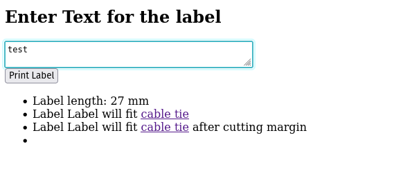

# Quick and dirty web frontend for the Dynmo LabelManager PnP
This project utilizes the [Labelle](https://github.com/labelle-org/labelle) Python package and Flask to build a simple frontend for printing labels.
We use this tool as a systemd service on a lab machine to print labels from any machine in the lab with ease.


*Note*: The last bullet in the list in the screenshot is to show error messages, e.g. of the labelmanaer is turned off.


## Getting a device
Dynmo LabelManager PnP is out of stuck. We bought ours on eBay and Kleinanzeigen.
It fits Dymo D1 cartriges.
We use 9mm labels, which is hardcoded in the `labelmaker.py`, but can be changed

### Cable labelling
We use [TRU COMPONENTS TC-MC1203-100](https://www.conrad.de/de/p/tru-components-tc-mc1203-100-kabelmarkierer-montage-art-kabelbinder-beschriftungsflaeche-32-x-11-mm-natur-100-st-3013928.html?refresh=true) zi ties to attach the labels to cables. The frontend checks if the labelsize will fit the zip tie panel.

**Attention**: The value for the cutting margin option is wrong

## Installation 
We provide a Systemd Service unit to run this under Ubuntu.
Install the service with `install.sh`.
After installing the website is accessible via http://localhost:5000 on the local machine.
```bash
git clone https://github.com/QFL-Lab/labelmaker
cd labelmanager

chmod +x install.sh start.sh
./install.sh

# to check the status of the service
systemctl --user status labelmaker.service

# to stop the service
systemctl --user stop labelmaker.service
```

## Website
This website is served by our lab survailance machine via a reverse proxy (nginx).
Using this we can print label from any machine in the lab accessing e.g. http://label.group.my-uni.edu